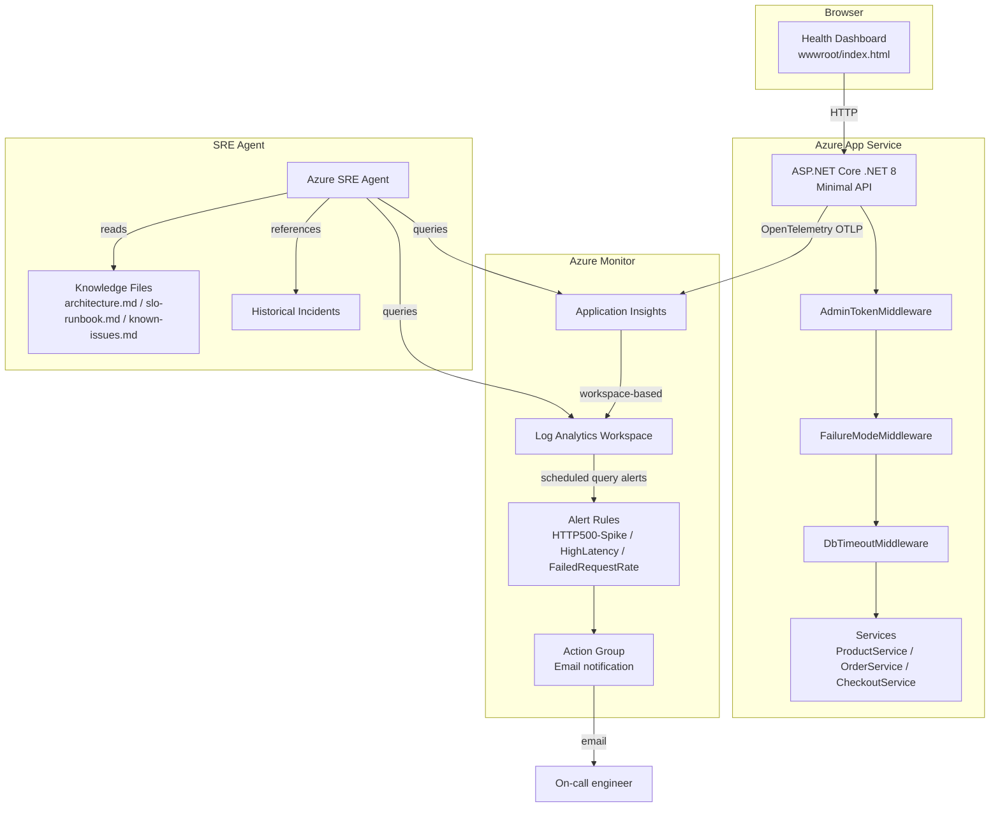

# Architecture — Azure SRE Agent Demo

> **SRE Agent Knowledge File** — Upload this file to Azure SRE Agent → Knowledge Files.

## System Overview

This is a simulated e-commerce API running on Azure App Service. It generates realistic observability data (requests, dependencies, exceptions, custom metrics) that Azure SRE Agent uses to investigate incidents.

All "database" operations are **simulated in-memory** — no external dependencies, instant deploy.

---

## Architecture Diagram



---

## Request Pipeline

Every inbound request flows through this middleware chain:

```
HTTP Request
    │
    ▼
AdminTokenMiddleware
    │ (for /admin/* routes only)
    │ • Reads X-Admin-Token header
    │ • Compares to ADMIN_TOKEN env var (constant-time)
    │ • Returns HTTP 401 if invalid
    ▼
FailureModeMiddleware
    │ (when ENABLE_FAILURE_MODE=true)
    │ • 30% of requests → throw SimulatedFailureException
    │ • Random delay 3–8 seconds
    │ • Logs ErrorCode, CorrelationId, DeploymentVersion
    ▼
DbTimeoutMiddleware
    │ (when ENABLE_DB_TIMEOUT=true)
    │ • Wraps DB operations in Polly retry (3 retries, exp backoff)
    │ • Simulates TaskCanceledException / TimeoutException
    │ • Logs retry events as dependency telemetry
    ▼
Endpoint Handler
    │
    ▼
Service Layer (ProductService / OrderService / CheckoutService)
    │ • Simulated latency: reads ~50ms, writes ~80ms
    │ • ActivitySource spans for distributed tracing
    ▼
Application Insights (via OpenTelemetry)
```

---

## API Endpoints

| Method | Path | Normal behavior | Failure mode behavior |
|---|---|---|---|
| `GET` | `/health` | Returns version, flags, uptime | Same (health is always truthful) |
| `GET` | `/products` | 200 OK, product list, ~50ms | 30% chance HTTP 500, 3–8s delay |
| `POST` | `/orders` | 200 OK, order created, ~80ms | 30% chance HTTP 500, 3–8s delay |
| `POST` | `/checkout` | 200 OK, orchestrates products+orders | 30% chance HTTP 500, 3–8s delay |
| `POST` | `/admin/failure-mode` | Toggles ENABLE_FAILURE_MODE flag | Requires X-Admin-Token header |
| `POST` | `/admin/db-timeout` | Toggles ENABLE_DB_TIMEOUT flag | Requires X-Admin-Token header |
| `GET` | `/admin/config` | Returns current flag state + token | Requires X-Admin-Token header |

---

## Feature Flags

| Environment Variable | Default | Effect |
|---|---|---|
| `ENABLE_FAILURE_MODE` | `false` | 30% HTTP 500, 3–8s artificial delay, structured exceptions |
| `ENABLE_DB_TIMEOUT` | `false` | DB timeout simulation with Polly retries |
| `ADMIN_TOKEN` | `<guid>` | Generated by Bicep `newGuid()` at deploy time |
| `DEPLOYMENT_VERSION` | `initial` | Overwritten with git SHA by CI/CD |

---

## Observability Data Flow

```
App Code
    │
    ▼ OpenTelemetry SDK (Microsoft.Azure.Monitor.OpenTelemetry.AspNetCore)
    │
    ├── Traces    → requests table (App Insights)
    ├── Metrics   → customMetrics table
    │              • checkout.duration
    │              • db.query.duration
    │              • order.failure.count
    ├── Logs      → traces / exceptions table (Serilog → App Insights sink)
    │              Structured properties on every record:
    │              • deployment.version
    │              • correlation.id
    │              • active.flags
    │              • error.code (on failures)
    └── Dependencies → dependencies table
                       • Simulated DB calls
                       • Retry attempts (Polly)
```

---

## Infrastructure

| Resource | SKU | Purpose |
|---|---|---|
| App Service Plan | B1 Linux | Hosts the API |
| App Service | .NET 8 | Runs SreAgentDemo.Api |
| Application Insights | Workspace-based | Telemetry ingestion |
| Log Analytics Workspace | PerGB2018 | Telemetry storage + KQL queries |
| Alert Rule: HTTP500-Spike | Scheduled query | Detects error rate spike |
| Alert Rule: HighLatency | Scheduled query | Detects p95 > 2s |
| Alert Rule: FailedRequestRate | Scheduled query | Detects > 10% failure rate |
| Action Group | Email | Notifies on-call |

---

## Deployment Topology

```
GitHub Repository
    │
    ├── Push to main ──► deploy.yml (GitHub Actions)
    │                        │
    │                        ├── dotnet build + test
    │                        ├── dotnet publish
    │                        ├── azure/webapps-deploy
    │                        └── set DEPLOYMENT_VERSION=$GITHUB_SHA
    │
    └── workflow_dispatch ──► toggle-failure.yml
                                 │
                                 ├── Fetch ADMIN_TOKEN from App Settings
                                 ├── Set ENABLE_FAILURE_MODE / ENABLE_DB_TIMEOUT
                                 └── Call /admin/* with X-Admin-Token header
```

Authentication: **OIDC federated credentials** — no long-lived secrets in GitHub.

---

## SRE Agent Connection Points

When configuring Azure SRE Agent for this demo:

1. **Logs** → Connect Application Insights resource `ai-sre-demo` AND Log Analytics Workspace `law-sre-demo`
2. **Azure Resources** → Scope to Resource Group `rg-sre-demo` (grants access to App Service, alerts, etc.)
3. **Code** → Connect this GitHub repository (SRE Agent reads source for deployment correlation)
4. **Knowledge Files** → Upload:
   - `docs/architecture.md` (this file)
   - `docs/slo-runbook.md`
   - `docs/known-issues.md`
   - `docs/historical-incidents/incident-001.md` through `incident-005.md`

**Deployed resources:** Resource Group `rg-sredemo-swe` • Sweden Central • App: `sredemo-mim-app` • URL: `https://sredemo-mim-app.azurewebsites.net`
